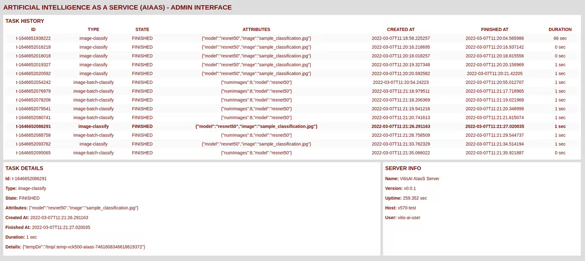

# AIaaS on the VCK5000 - API Server Implementation

This folder contains the **API Server** implementation of the **Artificial Intelligence as a Service (AIaaS)** project.

The **API Server** component is build as **Spring Boot** application written in **Java**. The server implements the REST API defined inthe OpenAPI specification file.

The **API Server** is responsible for comunication, file management, input-output and other functions.

The actual **hardware accelerated AI workloads** are implemented as pre-compiled **VitisAI MicroApps**. The **API Server** launches this applications with input from the web requests. The produced output is then collected, parsed and returned to the callers.

An **Administration Web Interface** offering **management** functions is also exposed. This can be used to inspect the server status, task history and task details.

