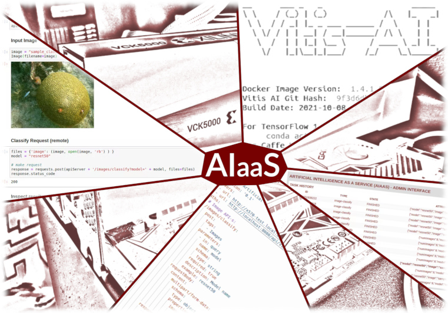
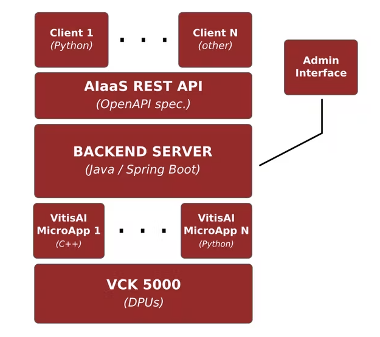

# Artificial Intelligence as a Service (AIaaS) on the VCK5000

The full project description is available on **Hackster.io** project page: 
[Artificial Intelligence as a Service (AIaaS) on the VCK5000](https://www.hackster.io/bluetiger9/artificial-intelligence-as-a-service-aiaas-on-the-vck5000-d5b049)

## High Level Architecture

The **High-Level Architecture** of the system looks like this:

The system is composed from a **Server**, **API** and **Client** components. The contract between **Server** and **Client** is defined as an **Open API specification** file.

The **Backend Server** is a web application implementing the AIaaS REST API. The application is written in **Java** using the **Spring Boot** framework, and is responsible for general management tasks.

A set of so called **VitisAI MicroApp-s** are used to implement different hardware accelerated AI workloads. These are **C++** applications built over the Vitis AI libraries.

Tbe **Client**-s can be either manually written or automatically generated from the API specification.

## Folder Structure

This repository is **structured** as follows:
- **API** - Open API Specification of the Artificial Intelligence as a Service (AIaaS)
- **Backend** - Backend implementation - Spring Boot API Server + VitisAI Micro-Apps
- **Client**  - Clients and Examples

## License

All the **code** in this repository is **licensed** under the **Apache License**, v2.0.

The **documentation** on Hackster.io is available under **Creative Commons
 Attribution-ShareAlike 4.0 International** (CC BY-SA 4.0) license.